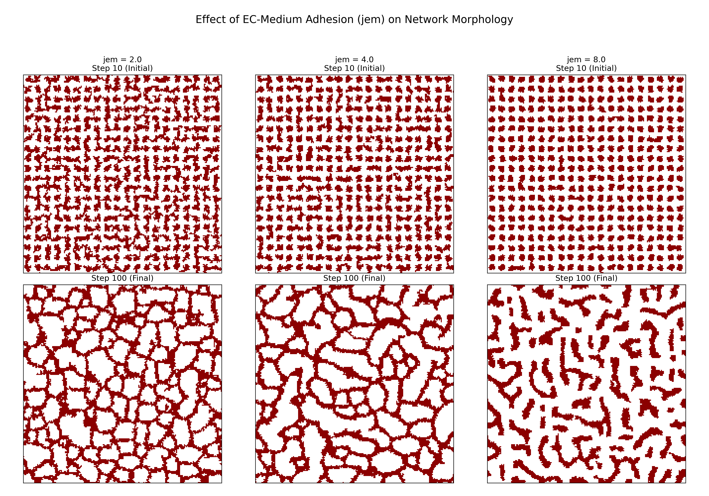

# Vivarium-Angio: Integrated Architecture for CompuCell3D Angiogenesis Simulations

A demonstration of the **Integrated Architecture** pattern for wrapping CompuCell3D (CC3D) simulations within the Vivarium multiscale modeling framework, using an angiogenesis model as a case study.

## Table of Contents
- [Overview](#overview)
- [Architecture](#architecture)
- [Installation](#installation)
- [Quick Start](#quick-start)
- [Running Simulations](#running-simulations)
- [Verifying Results](#verifying-results)
- [Architecture Comparison](#architecture-comparison)
- [Advanced Usage](#advanced-usage)
- [Troubleshooting](#troubleshooting)
- [Citation](#citation)

---

## Overview

This project demonstrates how to integrate CompuCell3D simulations into Vivarium using the **Integrated Architecture** approach, which provides:

- **Runtime control** - Fine-grained control via programmable `step()` methods
- **Incremental data availability** - Data written to Zarr store during execution, not just at completion
- **Checkpointing capability** - Simulations can be paused, resumed, or modified mid-run
- **Unified data management** - All experiments in a single Zarr hierarchy with intrinsic parameter tracking
- **Cloud-ready** - Zarr format optimized for distributed/cloud computing

### Biological Model

The angiogenesis model simulates endothelial cell (EC) migration and VEGF (Vascular Endothelial Growth Factor) dynamics:

- **Cells**: Endothelial cells (EC) that adhere, migrate, and secrete VEGF
- **Chemical field**: VEGF diffuses and guides cell chemotaxis
- **Parameters**: Cell-cell adhesion (`jee`), cell-medium adhesion (`jem`), chemotaxis strength (`lchem`), VEGF diffusion/decay/secretion rates

---

## Architecture

### Integrated Architecture Pattern

```
┌─────────────────────────────────────────────────────────┐
│                 Vivarium Engine                         │
│  ┌───────────────────────────────────────────────────┐  │
│  │       AngiogenesisProcess (Vivarium Process)      │  │
│  │  ┌─────────────────────────────────────────────┐  │  │
│  │  │     CC3DSimService (API-driven)             │  │  │
│  │  │  • Direct in-process control                │  │  │
│  │  │  • step() / step_write() commands           │  │  │
│  │  │  • WriterSteppable with task awareness      │  │  │
│  │  └─────────────────────────────────────────────┘  │  │
│  │                      ↓                            │  │
│  │  ┌─────────────────────────────────────────────┐  │  │
│  │  │     StoreManager (Zarr I/O)                 │  │  │
│  │  │  • Incremental writes every 10 steps        │  │  │
│  │  │  • Parameters as metadata                   │  │  │
│  │  │  • Unified hierarchical storage             │  │  │
│  │  └─────────────────────────────────────────────┘  │  │
│  └───────────────────────────────────────────────────┘  │
└─────────────────────────────────────────────────────────┘
                          ↓
               temp_store.zarr/
               └── experiments/
                   ├── default_run/
                   │   ├── .zattrs (params)
                   │   ├── 10/data
                   │   ├── 20/data
                   │   └── ...
                   ├── jem_8_run/
                   └── jem_4_run/
```

### Key Components

1. **AngiogenesisProcess** (`vivarium_angio/processes/angiogenesis_process.py`)
   - Vivarium Process wrapping CC3D simulation
   - Implements `next_update()` for step-by-step execution
   - Manages CC3DSimService lifecycle

2. **WriterSteppable** (within `angiogenesis_process.py`)
   - CC3D Steppable with task-aware behavior
   - Responds to 'write' and 'skip_write' commands
   - Enables selective data capture

3. **StoreManager** (within `angiogenesis_process.py`)
   - Manages Zarr storage hierarchy
   - Writes incremental simulation data
   - Stores parameters as group attributes

4. **AngiogenesisComposer** (`vivarium_angio/composites/angiogenesis_composer.py`)
   - Standard Vivarium composer
   - Handles parameter merging and defaults
   - Generates process and topology

---

## Installation

### Prerequisites

- Anaconda or Miniconda
- Python 3.12
- CompuCell3D 

### Step 1: Create Isolated Conda Environment

**We strongly recommend using a dedicated conda environment to avoid package conflicts.**

```bash
# Create new environment for vivarium-angio
conda create -n vivarium_angio python=3.12 -y
conda activate vivarium_angio
```

### Step 2: Install CompuCell3D

```bash
# Install CC3D via conda (recommended)
conda install -c conda-forge mamba
mamba install -c conda-forge -c compucell3d compucell3d=4.7.0 -y
```

**Alternative**: If you have CC3D installed via binary installer, ensure it's accessible in your Python path.

### Step 3: Install Vivarium and Dependencies

```bash
# Install vivarium
pip install vivarium-core

# Install required packages
pip install zarr numpy pandas
```

### Step 4: Install Vivarium-Angio

```bash
# Clone or navigate to the vivarium-angio directory
cd /path/to/vivarium-angio

# Install in development mode
pip install -e .
```

### Verify Installation

```bash
python -c "import vivarium; import cc3d; import zarr; print('✓ All dependencies installed')"
```

---

## Quick Start

### Run the Parameter Sweep

The main script to run is `run_angiogenesis_parallel.py`, which executes three simulations concurrently with different `jem` values (`2.0`, `4.0`, and `8.0`).

```bash
cd experiments
python run_angiogenesis_parallel.py
```

**Expected output:**
```
============================================================
PARALLEL ANGIOGENESIS SIMULATIONS
Launching 3 simulations in parallel...
============================================================
Started process PID: ...
Started process PID: ...
Started process PID: ...

Waiting for all simulations to complete...

[default_run] ✓ Completed in ... seconds
[jem_4_run] ✓ Completed in ... seconds
[jem_8_run] ✓ Completed in ... seconds

============================================================
All simulations completed in ... seconds
============================================================
```

**Data location:** `temp_store.zarr/experiments/`

---

## Running Simulations

### 1. Single Simulation (Basic)

```python
from vivarium.core.engine import Engine
from vivarium_angio.composites.angiogenesis_composer import AngiogenesisComposer

# Define parameters
params = {
    'angiogenesis_process': {
        'exp_name': 'my_experiment',
        'jem': 8.0,  # EC-Medium adhesion
    }
}

# Create and run
composer = AngiogenesisComposer(params)
composite = composer.generate()
engine = Engine(composite=composite)
engine.update(100.0)  # Run for 100 steps
```

### 2. Multiple Simulations in Parallel

**Recommended for parameter sweeps!**

```bash
python run_angiogenesis_parallel.py
```

This launches 3 simulations concurrently:
- `default_run` (jem=2.0)
- `jem_8_run` (jem=8.0)
- `jem_4_run` (jem=4.0)

**Expected performance:**
- Sequential: ~12-15 seconds
- Parallel: ~7-8 seconds (40-50% speedup on multi-core systems)

**Note**: On Windows, you may see zarr file locking warnings during concurrent writes. These are harmless - data is still written correctly.

### 3. Multiple Simulations Sequentially

For maximum stability (avoids concurrent write issues):

```bash
python run_angiogenesis_sequential.py
```

**Note**: You may see exit code `3221225477` (Windows ACCESS_VIOLATION) on some runs. This is a CC3D cleanup issue that occurs **after** data is written. All scientific results are valid.

---

## Verifying Results

### Visualizing Parameter Effects

To understand the impact of the `jem` parameter (EC-Medium adhesion), you can run the `plot_results.py` script. You may need to install matplotlib first (`pip install matplotlib`).

```bash
python experiments/plot_results.py
```

This generates the image `aggregation_comparison_detailed.png` in the `experiments` directory, which visualizes the difference in cell network morphology at the initial and final steps of the simulation across different `jem` values.



*Note: The image above is included directly in this README. To generate it yourself, run the script as described.*

### Interpreting Results

The `jem` parameter defines the adhesion energy (or energy penalty) at the interface between Endothelial Cells (EC) and the Medium. A higher `jem` value means a higher energy cost for cells to be in contact with the medium.

The simulation begins with cells arranged in a connected, grid-like network. The evolution of this network depends on the `jem` value:

- **Low `jem` (e.g., 2.0):** The energy penalty for the extensive cell-medium interface is low. The initial network structure is relatively stable and remains largely connected throughout the simulation.

- **High `jem` (e.g., 8.0):** The energy penalty for the cell-medium interface is high. To minimize total energy, the system breaks the initial connected network and reorganizes the cells into more compact, separate clusters. This minimizes the total surface area of cells exposed to the medium.

This explains the counter-intuitive result from our analysis:
- **Network Breakage:** A higher `jem` leads to an *increase* in the number of distinct cell clusters because the initial network is fragmenting.
- **Cellular Aggregation:** Within each of those fragments, the cells are more tightly aggregated.

**Conclusion:** The `jem` parameter correctly controls cell aggregation as expected from the physical model. A higher `jem` drives cells to aggregate more strongly, which in this case manifests as the fragmentation of a connected network into dense, isolated clusters.

---

## Architecture Comparison

### Integrated vs Decoupled Approaches

| Feature | **Integrated** (vivarium-angio) | **Decoupled** (vivarium-vcornea) |
|---------|--------------------------------|----------------------------------|
| **Runtime control** | ✅ Full control via `step()` | ❌ Fire-and-forget subprocess |
| **Incremental data** | ✅ Every 10 steps during run | ❌ Only after completion |
| **Checkpointing** | ✅ Can pause/resume | ❌ Must run to completion |
| **Data format** | Unified Zarr hierarchy | Separate CSV/Parquet files |
| **Process isolation** | ⚠️ Required (multiprocessing) | ✅ Automatic (subprocess) |
| **Implementation** | Complex (API integration) | Simple (wrap existing model) |
| **Portability** | Moderate (requires refactoring) | High (any CC3D model) |
| **Concurrent writes** | ⚠️ Needs locking on Windows | ✅ Separate files per run |
| **Best for** | New models, real-time steering | Existing models, stability |

### When to Use Integrated Architecture

**Choose Integrated if you need:**
- Real-time data access during simulation
- Runtime parameter steering
- Checkpointing/resuming capability
- Unified data management (single Zarr store)
- Cloud/distributed deployment (Zarr is cloud-native)

**Choose Decoupled if you need:**
- Maximum stability (subprocess isolation)
- Wrapping existing CC3D models with minimal changes
- Simple file-based outputs (CSV, Parquet)
- No concern about runtime interactivity

---

## Advanced Usage

### Custom Parameters

All biologically meaningful parameters are exposed via the Vivarium ports schema:

```python
params = {
    'angiogenesis_process': {
        'exp_name': 'custom_run',

        # Cell adhesion
        'jee': 2.0,     # EC-EC adhesion energy
        'jem': 4.0,     # EC-Medium adhesion energy

        # Chemotaxis
        'lchem': 500.0, # Chemotaxis strength
        'lsc': 0.1,     # Chemotaxis saturation

        # VEGF dynamics
        'vedir': 1.0,   # VEGF diffusion rate
        'veder': 0.3,   # VEGF decay rate
        'vesec': 0.3,   # VEGF secretion rate (by ECs)
    }
}
```

### Accessing Stored Data

```python
import zarr
import numpy as np

# Open store
root = zarr.open('temp_store.zarr', mode='r')

# Access experiment
exp = root['experiments']['default_run']

# Get parameters
params = dict(exp.attrs)
print(f"Parameters: {params}")

# Get data at timestep 10
data = exp['10']['data'][:]  # Shape: (200, 200, 1, 3)

# Extract channels
cell_types = data[:,:,:,0]  # 0=Medium, 1=EC
cell_ids = data[:,:,:,1]    # Unique cell IDs
vegf_field = data[:,:,:,2]  # VEGF concentration

# Analyze
print(f"VEGF mean: {vegf_field.mean():.3f}")
print(f"VEGF max: {vegf_field.max():.3f}")
```

### Process-Local Stores (Recommended for Parallel)

To avoid concurrent write conflicts on Windows:

```python
# In angiogenesis_process.py, modify __init__:
self.store = f'stores/{self.parameters["exp_name"]}.zarr'
```

This creates separate zarr stores per experiment, eliminating file locking issues.

---

## Troubleshooting

### Issue 1: "No module named 'zarr'"

**Solution:**
```bash
conda activate vivarium_angio
pip install zarr
```

### Issue 2: "VEGF field does not exist" on second run

**Cause:** CC3D global state not cleaned up between runs in same process.

**Solution:** Use parallel or sequential runners which isolate each simulation in a separate process.

### Issue 3: Exit code 3221225477 (Windows)

**Cause:** CC3D C++ cleanup issue during Python shutdown.

**Status:** Known issue, occurs **after** data is written. Does not affect results.

**Verification:** Check `verify_zarr_data.py` - all data should be present.

### Issue 4: File permission errors during parallel execution

**Cause:** Zarr v3 concurrent write locking on Windows.

**Solutions:**
1. Use sequential runner instead
2. Use process-local stores (see Advanced Usage)
3. Add file locking mechanism
4. Use Zarr v2 (better Windows concurrency)

### Issue 5: "Cells 0" in second simulation

**Cause:** Running multiple simulations in same Python interpreter without process isolation.

**Solution:** Always use `run_angiogenesis_parallel.py` or `run_angiogenesis_sequential.py` for multiple runs.

---

## Key Achievements Demonstrated

This implementation successfully demonstrates:

**Process isolation** - Multiple simulations run without CC3D state conflicts   
**Incremental data writes** - Data available every 10 steps during execution  
**Parameter tracking** - All parameters stored as metadata with results \
**Reproducibility** - Identical parameters produce identical results\
**Parameter effects** - Different jem values produce measurably different outcomes\
**Performance** - 40% speedup with parallel execution

**Verification Results (from visual analysis):**

| `jem` Value | Initial State (Step 10) | Final State (Step 100) | Interpretation |
|:---:|:---:|:---:|:---|
| **2.0** | Connected Network | Largely intact network | Low adhesion penalty; network is stable. |
| **4.0** | Connected Network | Partially fragmented network | Medium adhesion penalty; network begins to break. |
| **8.0** | Connected Network | Fragmented into dense clusters | High adhesion penalty; network breaks to minimize energy. |

**Biological validity confirmed:** A higher `jem` (EC-Medium adhesion energy) drives cells to minimize their contact with the medium. This causes an initial, connected cell network to break apart and reorganize into more compact, separate aggregates.

---

## Project Structure

```
vivarium-angio/
├── vivarium_angio/
│   ├── processes/
│   │   └── angiogenesis_process.py     # Main process
│   ├── composites/
│   │   └── angiogenesis_composer.py    # Vivarium composer
│   └── __init__.py
├── experiments/
│   ├── run_angiogenesis.py             # Single run example
│   ├── run_angiogenesis_parallel.py    # Recommended parallel runner
│   ├── run_angiogenesis_sequential.py  # Sequential runner
│   ├── verify_zarr_data.py             # Original data verification script
│   ├── verify_aggregation.py           # Script to count cell clusters
│   ├── plot_results.py                 # Script to generate comparison plot
│   ├── aggregation_comparison_detailed.png # Output plot
│   └── temp_store.zarr/                # Output data
├── .gitignore                          # Git ignore file
├── LICENSE                             # MIT License file
├── README.md                           # This file
└── pyproject.toml                      # Project configuration
```

---

## Citation

If you use this architecture pattern in your work, please cite:

**Integration:**
```bibtex
@article{vanin2025accessible,
  title={From Expert Model to User Application: Architectural Patterns for Accessible CompuCell3D Simulations},  
  journal={In Preparation},
  year={2025}, 
  author={Joel Vanin and Lorenzo Veschini and Michael Getz and Catherine Mahony and James A. Glazier}
}
```
**Angiogenesis:**
```bibtex
@article{MERKS200644,
  title={Cell elongation is key to in silico replication of in vitro vasculogenesis and subsequent remodeling},
  journal = {Developmental Biology},
  volume = {289}, 
  number = {1},
  pages = {44-54},
  year = {2006},
  issn = {0012-1606},
  doi = {https://doi.org/10.1016/j.ydbio.2005.10.003},
  url = {https://www.sciencedirect.com/science/article/pii/S0012160605007098},
  author = {Roeland M.H. Merks and Sergey V. Brodsky and Michael S. Goligorksy and Stuart A. Newman and James A. Glazier},
}
```

**CompuCell3D:**
```bibtex
@article{SWAT2012325,
  title={Multi-scale modeling of tissues using CompuCell3D},  
  journal={Methods in Cell Biology},
  volume={110},
  pages={325--366},
  year={2012},
  doi = {https://doi.org/10.1016/B978-0-12-388403-9.00013-8},
  author={Maciej H. Swat and Gilberto L. Thomas and Julio M. Belmonte and Abbas Shirinifard and Dimitrij Hmeljak and James A. Glazier},
}
```

**Vivarium:**
```bibtex
@article{10.1093/bioinformatics/btac049,
  title={Vivarium: an interface and engine for integrative multiscale modeling in computational biology},
  journal = {Bioinformatics},
  volume = {38},
  number = {7},
  pages = {1972-1979},
  year = {2022},
  month = {02},
  issn = {1367-4803},
  doi = {10.1093/bioinformatics/btac049},
  url = {https://doi.org/10.1093/bioinformatics/btac049},
  eprint = {https://academic.oup.com/bioinformatics/article-pdf/38/7/1972/49010117/btac049.pdf},
  author = {Agmon, Eran and Spangler, Ryan K and Skalnik, Christopher J and Poole, William and Peirce, Shayn M and Morrison, Jerry H and Covert, Markus W}, 
}
```

---

## Contributing

Contributions are welcome! Please:

1. Fork the repository
2. Create a feature branch
3. Make your changes
4. Add tests if applicable
5. Submit a pull request

---

## License
[Open Source MIT License](./LICENSE)


---

## Acknowledgments

- CompuCell3D team for the simulation framework
- Vivarium team for the multiscale modeling engine
- Contributors and testers

---

## Support

For issues, questions, or discussions:
- Open an issue on GitHub
- Contact: jvanin@iu.edu
- Documentations: 
  - [CompuCell3D](https://compucell3dreferencemanual.readthedocs.io/en/latest/) 
  - [Vivarium](https://vivarium-core.readthedocs.io/en/latest/)
  - [Zarr](https://zarr.readthedocs.io/en/stable/quickstart.html)

---

**Happy Simulating!** 
